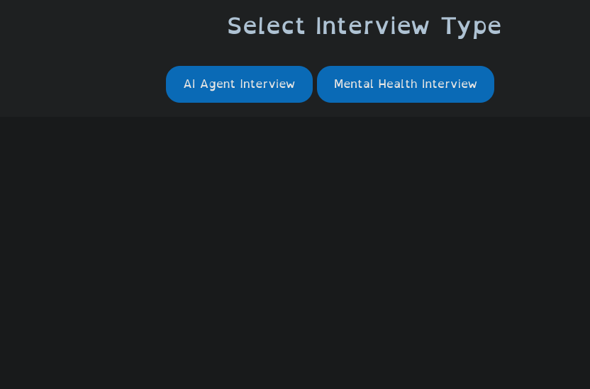
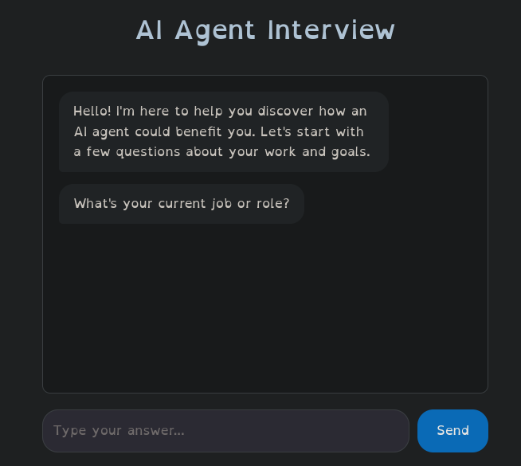
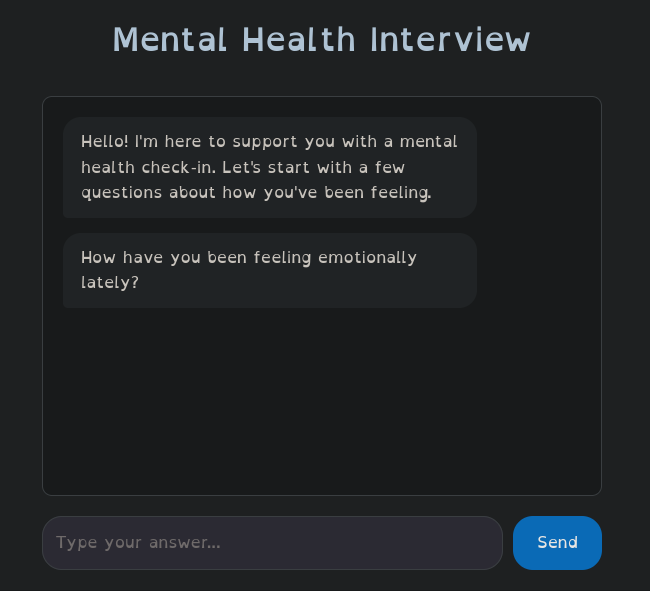

# AI Interview Tool

A web-based interview tool that offers two types of interactive questionnaires:
1. **AI Agent Interview** - Helps users discover how an AI agent could benefit them professionally
2. **Mental Health Interview** - Provides a supportive mental health check-in experience

## Features

- Interactive chatbot interface with follow-up questions
- Two distinct interview modes with tailored questions
- Personalized suggestions based on user responses
- Clean, responsive UI with tab navigation
- Menu-driven interface to select interview type

## Project Structure

```
webapp/
├── index.html              # Main HTML file with menu and interview screens
├── style.css               # Styles for the application
├── script.js               # JavaScript logic for interviews and UI
├── server.py               # Simple Python server script
├── server_control.py       # Server control utilities
├── README.md               # This file
├── PROGRAM_DESCRIPTION.md  # Detailed program documentation
├── .gitignore             # Git ignore rules
├── mainmenu.png           # Screenshot: Main menu screen
├── aichat.png             # Screenshot: AI Agent interview
└── heath.png              # Screenshot: Mental Health interview
```

## Prerequisites

- Python 3.x (for running the local server)
- Modern web browser (Chrome, Firefox, Safari, Edge)

## Setup & Running

1. **Clone the repository**
   ```bash
   git clone <repository-url>
   cd webapp
   ```

2. **Start the server**
   ```bash
   python3 -m http.server 8000
   ```
   Or use the included server script:
   ```bash
   python3 server.py
   ```

3. **Access the application**
   Open your browser and navigate to:
   ```
   http://localhost:8000
   ```

## Screenshots

### Main Menu

*The starting menu where users select their interview type*

### AI Agent Interview

*Interactive chat interface for AI Agent interview*

### Mental Health Interview

*Mental Health check-in interview interface*

## Usage

1. When the page loads, you'll see a menu asking you to select an interview type
2. Click either "AI Agent Interview" or "Mental Health Interview"
3. Answer the questions and follow-up prompts in the chat interface
4. After completing all questions, receive personalized suggestions
5. Use the tabs to switch between interview types at any time

## Technologies Used

- HTML5
- CSS3 (with Flexbox for layout)
- Vanilla JavaScript (ES6+)
- Python (for local development server)

## Files Description

- **index.html** - Main page with menu screen and interview interface
- **style.css** - Styling for chat interface, buttons, and responsive design
- **script.js** - Interview logic, question flows, and DOM manipulation
- **PROGRAM_DESCRIPTION.md** - Detailed documentation of the program structure and behavior

## Notes

- This is a client-side application; no backend database is required
- All interview data is processed in the browser session only
- For production use, consider adding server-side data persistence

## License

Apache License 2.0 - See LICENSE file for details.